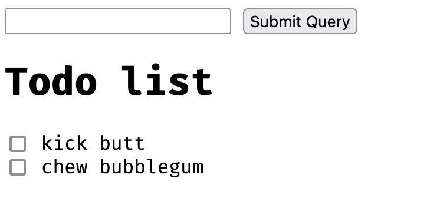

# SQL and Data Modeling for the Web

## Course Introduction

Topics covered:

* How to do *Create*, *Read*, *Update*, and *Delete* (*CRUD*) operations
* How to apply these operations across both *databases* and *web applications*
* How to set up *relationships* between elements of an application
* How to think about important principles and patterns in building *data models* for a web application

### Tech Stack

* Python 3
* `Flask`
* `PostgresSQL`
* `psycopg2`
* `SQLAlchemy`
* `Flask-SQLAlchemy`

## Lesson 2: Interacting with Databases

### Intro

Topics covered:

* Interacting with a remote database (Postgres)
* Database Application Programming Interfaces (DBAPI)
* `psycopg2`

### Relational Databases

A database is a collection of data. A database system is a system for storing, retrieving, and writing data to ta
database. Benefits of databases include:

* Persistence
* Shared source of truth
* Ability to store many types of data
* Concurrency control There are many other types of databases not covered in this course:
* Document stores, like MongoDB
* Object databases, like Perst
* Column stores, like Cassandra
* Graph databases like Neo4j

#### Additional Resources

* [Intro to Relational Databases](https://www.udacity.com/course/intro-to-relational-databases--ud197)  Udacity course
* [An Introduction to Relational Databases](https://www.youtube.com/watch?v=z2kbsG8zsLM)  YouTube video

### Primary Keys & Foreign Keys

#### Primary Key

Every row should have a column or set of columns that is a unique identifier for a particular row. PKs with multiple
columns are known as **composite keys**.

#### Foreign Key

A primary key in another table, these are used to map relationships between tables.

### SQL

Structured Query Language (SQL) is a standard language for interacting with a database. There are many different
dialects of SQL. This course will cover:

* `INSERT`
* `UPDATE`
* `DELETE`
* `SELECT`
* `CREATE TABLE`
* `ALTER TABLE`
* `DROP TABLE`
* `ADD COLUMN`
* `DROP COLUMN`
* `INNER/OUTER JOIN` (`LEFT` and `RIGHT`)
* `GROUP BY`, `SUM`, and `COUNT`

### Execution Plan

The DBMS takes SQL and generates a query plan. The plan can be reviewed and the query tweaked to improve performance.
See also:

* [Explaining the unexplainable – part 2 – select * from depesz;](https://www.depesz.com/2013/04/27/explaining-the-unexplainable-part-2/#seq-scan)
* [25 tips to Improve SQL Query Performance - WinWire](https://www.winwire.com/25-tips-to-improve-sql-query-performance/)
* [PostgreSQL CREATE INDEX By Practical Examples](http://www.postgresqltutorial.com/postgresql-indexes/postgresql-create-index/)
* [Use the Force, Luke](https://i.imgflip.com/3oakl8.jpg)
* [What is a HashTable Data Structure](https://www.youtube.com/watch?v=MfhjkfocRR0)  video explanation by Paul
  Programming
* [Intro to Hash tables](https://www.slideshare.net/AmyHua/intro-to-hash-tables)

### Client-Server Model

A server is a centralized program that communicates over a network to provide some service to *clients*. A client is a
program (a web browser, for instance) that can request data from the server.

#### Adding databases

A database client is any program that can send a request to a database. The web server can simultaneously be a client of
the database.

```
Client ---> Server ---> Database
```

### TCP/IP

Transmission Control Protocol/Internet Protocol (TCP/IP) is a set of communication rules that hosts use to communicate
with one another on the Internet. Postgres fulfills the standard client/server model and was designed to be used over
the web.

An IP address identifies the location of a computer on a network. Each IP address has many ports, which are used to
route different types of traffic. HTTP traffic typically uses port 80 and Postgres typically uses 5432.

#### Additional Resources

* In addition to *port 80* and *port 5432*, there are a number of other common ports you might want to get familiar
  with. Here’s a list of  [14 of the most common ports](https://opensource.com/article/18/10/common-network-ports) .
* If you’re interested in going into much greater depth on computer networking, you can check out the
  free  [Udacity Course on Computer Networking offered by Georgia Tech](https://www.udacity.com/course/computer-networking--ud436)
  .

### Connections and Sessions in TCP/IP

Since TCP/IP is a connection-based protocol, a client and server will need to establish a **connection** to communicate
with one another. Connecting starts a **session**. In a database session, many **transaction** can occur. A **
transaction** does work to commit changes to a database.

### Transactions

Transactions capture logical bundles of work. Work is structured into transactions so that it can either succeed or
fail. In case of success, the work is done, and in case of failure, the transaction is rolled back. To ensure
consistency and integrity, databases use these atomic transactions to handle commits and rollbacks correctly. These are
known as **[ACID transactions](https://www.geeksforgeeks.org/acid-properties-in-dbms/)**:

* Atomic
* Consistency
* Isolation
* Durability

### DBAPIs and `psycopg2`

A Database Application Programming Interfaces (DBAPIs) provides a standard interface for a programming language to talk
to a relational database. These are sometimes known as database adapters. Different APIs exist for every server,
framework, or language/database system. Examples of these include:

* For Ruby (e.g. for Sinatra, Ruby on Rails):  [pg](https://www.ruby-toolbox.com/projects/pg)
* For NodeJS:  [node-postgres](https://node-postgres.com/)
* For Python (e.g. for Flask, Django):  [pyscopg2](http://initd.org/psycopg/)

## Lesson 3: SQLAlchemy Basics

### Intro

SQLAlchemy is the most popular open source Python library for relational databases. It’s an Object-Relational Mapping (
ORM) library, which provides an OOP interface for database interactions.

#### OOP Syntax

A `CREATE TABLE` statement like the following:

```
CREATE TABLE todos (
	id INTEGER PRIMARY KEY,
	description VARCHAR NOT NULL,
	completed BOOLEAN NOT NULL DEFAULT FALSE
);
```

can be written in SQLAlchemy like this:

```
# Our todo table inherits from SQLAlchemy's db model
class Todo(db.Model):
	id = db.Column(db.Integer, primary_key=True)
	description = db.Column(db.String(), nullable=False)
	completed = db.Column(db.Boolean, nullable=False, default=False)
```

A query like this:

```
SELECT * FROM todos
```

becomes this, which has the additional benefit of being dialect-agnostic:

```
Todo.query.all()
```

#### Additional Benefits

* Features **function-based query construction**: allows SQL clauses to be built via Python functions and expressions.
* **Avoid writing raw SQL**. It generates SQL and Python code for you to access tables, which leads to less
  database-related overhead in terms of the volume of code you need to write overall to interact with your models.
* Moreover, you can **avoid sending SQL to the database on every call**. The SQLAlchemy ORM library features **automatic
  caching**, caching collections and references between objects once initially loaded.

#### ORMs in other languages

* [Sequelize](https://sequelize.org/)  and  [Bookshelf.js](https://bookshelfjs.org/)  for NodeJS
* [ActiveRecord](https://guides.rubyonrails.org/active_record_basics.html) , which is used
  inside  [Ruby on Rails](https://rubyonrails.org/)
* [CakePHP](https://book.cakephp.org/3/en/orm.html)  for PHP.

### Layers of Abstraction

DBAPIs are simple but not scalable or conducive to complexity. SQLAlchemy offers several layers of abstraction and
tooling for more convenient DB interactions:


The lowest level offers a DBAPI, but SQLAlchemy is simply a SQL generator. SQLAlchemy depends on `psycopg2` or other
DBAPIs to send statements to the database. At the other end is the ORM, which allows Pythonic dialect-agnostic
interactions.

### The Dialect

The Dialect layer abstracts dialects away from the developer. It allows us to switch out seamlessly between them.
[SQLAlchemy Docs on the Dialect](https://docs.sqlalchemy.org/en/latest/dialects/)

### The Connection Pool

This abstracts the need to open, close, and manage connections to DBs. Connections are easily reused after they are
started. This reduces dropped connections and helps avoid making many small changes.
[SQLAlchemy Docs on its Connection Pooling](https://docs.sqlalchemy.org/en/latest/core/pooling.html)

### The Engine

The Engine is one of three main layers for how we interact with the database. It is the lowest layer of database
interaction and is similar to using `psycopg2` to manage a connection directly.

```
from sqlalchemy import create_engine

engine = create_engin("postgres://...")
conn = engine.connect()
result = conn.execute("SELECT * FROM vehicles;")

row = result.fetchone()
rows = result.fetchall()

result.close()
```

* The Engine in SQLAlchemy refers to both itself, the Dialect and the Connection Pool, which all work together to
  interface with our database.
* A connection pool gets automatically created when we create a SQLAlchemy engine.
  [SQLAlchemy Docs on the Engine](https://docs.sqlalchemy.org/en/latest/core/engines.html) .

### SQL Expressions

Instead of sending raw SQL using the Engine, we can build Python objects:

```
# Instantiate a table
todos = Table("todos", ...)

# Insert values
ins = todos.insert().values(
	description="Clean my room",
	completed=False
)

# Select rows
s = select([todos])

conn = engine.connect()
result = conn.execute(ins)
result = conn.execute(s)

result.close()

todos.c.description
	-> <Column 'description' in 'todos' table>
```

### SQLAlchemy ORM

The ORM is the highest level of abstraction. The ORM lets us compose SQL expressions by building Python objects which
map to tables in the database.

SQLAlchemy is split into two libraries:

* SQLAlchemy Core
* SQLAlchemy ORM: offered as an optional library
    * ORM uses the Core library inside
    * Lets us map from the database schema to the application’s objects
      

### Mapping Between Tables and Classes

In Python we instantiate a class like this:

```
class Human:
	def __init__(self, first_name, last_name, age):
		self.first_name = first_name
		self.last_name = last_name
		self.age = age
```

and create objects as instances of that class like this:

```
sarah = Human("Sarah", "Silverman", 48)
bob = Human("Bob", "Saget", 54)
```

In SQL we may create a similar table like this:

```
CREATE TABLE human (
	id INTEGER PRIMARY KEY,
	first_name VARCHAR,
	last_name VARCHAR,
	age INTEGER
);
```

Note the similarities:

* A column matches to a class attribute
* The table schema maps to the class definition
* Table rows map to instances of the class

### Hello App with Flask-SQLAlchemy - Part 1

* [Flask Docs](https://flask.palletsprojects.com/)  under “Quickstart”
* [Flask-SQLAlchemy Docs](http://flask-sqlalchemy.palletsprojects.com/)  under “Quickstart”
* [Primer on decorators from Real Python](https://realpython.com/primer-on-python-decorators/#decorators-with-arguments)
  . Application [here](./app.py)

### Connecting to the Database

A SQLAlchemy URI looks like this:


To add a SQLAlchemy connection to our Flask app, we need to do the following:

```
from flask import Flask
from flask_sqlalchemy import SQLAlchemy

app = Flask(__name__)
app.config['SQLALCHEMY_DATABASE_URI'] = 'postgresql://udacitystudios@localhost:5432/example'
db = SQLAlchemy(app)
```

### `db.Model` and Defining Models

Given an instance of the SQLAlchemy class from Flask-SQLAlchemy,

```
db = SQLAlchemy(app)
```

* `db` is an interface for interacting with our database
* `db.Model` lets us create and manipulate **data models**
* `db.session` lets us create and manipulate **database transactions**

### Syncing Models, `db.create_all()`

`db.create_all()` detects models and creates tables for them (if they don’t exist). SQLAlchemy will auto increment an
integer column set as the primary key.

### Inserting Records, Using Debug Mode

We’ll finish off creating a Hello App that says hello to our name by inserting a record into the persons table in our
database, and showing the person’s name on the index route.

```
postgres@localhost:mydb> INSERT INTO persons (name) VALUES ('Fitzy');
INSERT 0 1
Time: 0.019s
postgres@localhost:mydb> select * from persons
+------+--------+
| id   | name   |
|------+--------|
| 1    | Fitzy  |
+------+--------+
```

Exercise [here](./flask-hello-app.py)

### Experimenting in Interactive Mode

```
We can insert new records into the database using SQLAlchemy by running
person = Person(name=‘Amy’)
db.session.add(person)
db.session.commit()
```

### SQLAlchemy Data Types


SQLAlchemy data types. Source: https://flask-sqlalchemy.palletsprojects.com/en/2.x/models/

Flask-SQLAlchemy data types generally map to SQLAlchemy’s library of data types.

Check out the SQLAlchemy docs on Column and Data Types to learn more.

#### Resources

* [Flask-SQLAlchemy: Declaring Models](https://flask-sqlalchemy.palletsprojects.com/en/2.x/models/)
* [Getting Started with PostgreSQL Data Types](http://www.postgresqltutorial.com/postgresql-data-types/)

### SQLAlchemy Constraints

* Column constraints ensure data integrity across our database, allowing for database accuracy and consistency.
* Constraints are conditions on your column, that provide checks on the data’s validity. It does not allow data that
  violates constraints to be inserted into the database (it will raise an error if you attempt to).
* In SQLAlchemy, constraints are set in `db.Column()` after setting the data type.
    * `nullable=False` is equivalent to `NOT NULL` in SQL
    * `unique=True` is equivalent to `UNIQUE` in SQL Example

```
class User(db.Model):
  …
  name = db.Column(db.String(), nullable=False, unique=True)
```

* [SQLAlchemy Constraints Docs](https://docs.sqlalchemy.org/en/latest/core/constraints.html) . Constraints available in
  SQLAlchemy are (generally) available in Flask-SQLAlchemy, and exposed by db.<sqlalchemy_method_or_interface>.

### Additional Resources on SQLAlchemy

* Bookmark
  this:  [SQLAlchemy Cheat Sheet](https://github.com/crazyguitar/pysheeet/blob/master/docs/notes/python-sqlalchemy.rst#set-a-database-url)
* [Using PostgreSQL through SQLAlchemy](https://www.compose.com/articles/using-postgresql-through-sqlalchemy/)

## SQLAlchemy ORM in Depth

We can import the db object and Person class to introspect the table in Python

```
Python 3.9.5 (default, May 12 2021, 15:26:36)
Type 'copyright', 'credits' or 'license' for more information
IPython 7.24.1 -- An enhanced Interactive Python. Type '?' for help.

>>> # Import db and Person
>>> from flask_hello_app import db, Person

>>> # Select all persons and show the first ten
>>>  Person.query.all()[0:10]
[<Person ID: 1, name: Scott>,
 <Person ID: 2, name: Max>,
 <Person ID: 3, name: Alyssa>,
 <Person ID: 4, name: Twig>,
 <Person ID: 24, name: Gina>,
 <Person ID: 25, name: Michelle>,
 <Person ID: 26, name: Melissa>,
 <Person ID: 27, name: Jamie>,
 <Person ID: 28, name: Andrea>,
 <Person ID: 29, name: Allison>]

>>> # Find a specific person
>>> Person.query.filter_by(name="Max").all()
[<Person ID: 2, name: Max>]

>>> # Add a new person
>>> person = Person(name="Maximillian")
>>> db.session.add(person)
>>> db.session.commit()

>>> # Show our new person
>>> Person.query.all()[-1]
<Person ID: 64, name: Maximillian
```

### `Model.query`

The query object exists on a given model defined by us. It is the source of all select statements generated by the ORM.
Here are the most common methods:

```
# Select * from persons where name = 'Amy'
Person.query.filter_by(name="Amy")

# Select * from persons
Person.query.all()

# Select count(*) from persons
Person.query.count()

# More flexible filtering
Person.query(Person.name == "Amy", Team.name == "Udacity"

# Get person by primary key
Person.query.get(1)

```

Query enables easy bulk operations as well:

```
Product.query.filter_by(category="Misc").delete()
```

Finally, query provides method chaining:

```
Person.query \
	.filter(Person.name == "Amy") \
	.filter(Team.name == "Udacity") \
	.first()

Driver.query \
	.join("vehicles") \
	.filter_by(driver_id=3) \
	.all()
```

There are two ways to access the query object:

```
Person.query
is the same as
db.session.query(Person)
```

The latter is model-agnostic and useful for joins:

```
session.query(Person).join(Team)
```

#### Review and other useful methods:

```
# All records
MyModel.query.all()

# The first record
MyModel.query.first()

# All records with my_table_attribute of 'some value'
MyModel.query.filter_by(my_table_attribute='some value')
MyModel.query.filter(MyOtherModel.some_attr='some value')

# All orders with Product id of 3
OrderItem.query.filter(Product.id=3)

# Order by
MyModel.order_by(MyModel.created_at)
MyModel.order_by(db.desc(MyModel.created_at))

# Limit
Order.query.limit(100).all()

# Aggregates
query = Task.query.filter(completed=True)
query.count()

# Get object by id
model_id = 3
MyModel.query.get(model_id)

# Bulk deletes
query = Task.query.filter_by(category='Archived')
query.delete()

# Join
Driver.query.join('vehicles')
```

[SQLAlchemy Query Cheatsheet](https://video.udacity-data.com/topher/2019/August/5d5a52af_query-cheat-sheet/query-cheat-sheet.pdf)

* [SQLAlchemy Query API Documentation](https://docs.sqlalchemy.org/en/latest/orm/query.html)

### SQLAlchemy Object Lifecycle — Part 1

We can insert new records like

```
person = Person(name="Amy")
db.session.add(person)
db.session.commit()
```

This builds and commits a transaction. The changes won’t get committed until we run `db.session.commit()` We can
rollback an in-flight transaction by running `db.session.rollback()`.

#### Stages

1. Transient: an object is defined, but not attached to a session.
2. Pending: an object is attached to a session. We can rollback.
3. Flushed: almost ready for commit, this translates actions into SQL.
4. Committed: transaction is persisted and the transaction is cleared for subsequent changes.

### SQLAlchemy Object Lifecycle — Part 2

A flush takes pending changes and translates them into commit-ready commands. This occurs when we:

* call `Query`, or
* run `db.session.commit`


## Build a CRUD App with SQLAlchemy - Part 1

### Intro

In this section we’ll apply what we’ve learned so far to build a fully functional application. This section will cover
CRUD:

* CREATE —> `INSERT`
    * Creating new records, e.g., `db.session.add(user1)`
* READ —> `SELECT`
    * Reading records from user’s perspective, e.g., `User.query.all()`
* UPDATE —> `UPDATE`
    * User makes changes to something that already exists, e.g., `user1.foo = ’new value`
* DELETE —> `DELETE`
    * User deletes something, e.g., `db.session.delete(user1)`

We’ll also:

* Traverse all layers of the backend stack: Flask, Postgres, ORM, and SQL
* Develop using the MVC pattern to architect our application
* Handle schema evolution
* Model relationships between objects in our app
* Implement search functionality

### Create a dummy todo app

[dummy_todo](dummy_todo)

### Reading todo Items: the “R” in CRUD

[]()

### Model View Controller (MVC)

**MVC** stands for Model-View-Controller, a common pattern for architecting web applications

* ** ~Models~ **: manage data and business logic
* ** ~Views~ **: handle display & representation logic
* ** ~Controllers~ **: routes commands to models and views, contains control logic

When a user visits a site, they see the view, the HTML file. When they interact with the app, they send requests to the
controller. The controller processes the view’s request, sometimes updating the view directly, sometimes notifying the
model. The model handles database reads and writes, and model updates will update the view.

### Handling User Input

Creating, updating, and deleting requires taking user input and interaction with the database to figure out what/how to
change. To accept new todos in our application, we’ll want to:

* Implement an HTML form that accepts user input for new todo along with a submit button
* Send that request to the controller to retrieve the user input
* Update the model accordingly

In this section, we’ll:

1. Determine how to accept and get user data in Flask
2. Send data in controllers using db sessions in a controller
3. Manipulate models by adding records in SQLAlchemy models
4. Direct how the view should update

### Getting user data in Flask — Part 1

There are three ways to get user data from the view:

1. URL query parameters: `foo?field1=value1` and parsing them with `request.args`:

```
value1 = request.args.get("field1")
```

2. Using web forms and `request.form`:

```
username = request.form.get("username")
password = request.form.get("password")
```

3. Received JSON at the endpoint using `request.data`:

```
data_string = request.data
data_dictionary = json.loads(data_string)
```

`request.args.get` and `requests.form.get` both accept an optional second parameter:

```
request.args.get("foo", "my_default")
```

Forms take an `action`, which corresponds to the name of the route, and a `method`, which corresponds to the HTTP method

### Using AJAX to send data to Flask

* Data requests are either synchronous or asynchronous
* Async data requests are requests that get sent to the server and back to the client without a page refresh
    * This might be done using Axios or JQuery
* Async requests (AJAX requests) use one of two methods:
    * `XMLHttpRequest`
        * Uses window object, which is natively available on the browser
    * Fetch (the modern way)

#### `XMLHttpRequest`

Client-side code typically looks something like this when using `XMLHttpRequest ` to send AJAX requests:

```
// Build request object
var xhttp = new XMLHttpRequest();

// Fetch data from DOM
description = document.getElementById("description").value;

// Open connection from client to server
// Pass in route and query parameters
xhttp.open("GET", "/todos/create?description=" + description);

// Send the request and close the connection
xhttp.send();
```

In async requests, we need to react to the server on the client side. To update the loaded DOM client-side:

```
xhttp.onreadystatechange = function() {
	if (this.readyState === 4 && this.status === 200) {
		// on successful response
		console.log(xhttp.responseText)
	}
}
```

This is a clunky way of dealing with and reacting to client requests, so there are libraries like Axios to abstract this
away from the developer.

#### Fetch

Fetch is the more modern approach. It’s another window object that allows us to easily send requests and specify
parameters, headers, and the body.

```
fetch("/my/request", {
	method: "POST",
	body: JSON.stringify({
		"description": "some description here"
	}),
	headers: {
		"Content-Type": "application/json"
	}
})
```

### Using sessions in controllers

Controllers and sessions can be used to gracefully handle and display errors. Commits can either succeed or fail. On
failure, we usually want to roll the session back rather than inadvertently committing. Closing the connection before a
transaction will cause an implicit commit.

We can wrap our commit inside a `try` `except` block:

```
import sys

try:
	todo = Tod(description=description)
	db.session.add(todo)
	db.session.commit()
except:
	db.session.rollback()
	error=True
	print(sys.exc_info())
finally:
	db.session.close()
```

#### Resources on Error Handling

* [Flask Docs on Application Errors](https://flask.palletsprojects.com/en/1.0.x/errorhandling/)
* [Error Handling in Flask Tutorial](https://blog.miguelgrinberg.com/post/the-flask-mega-tutorial-part-vii-error-handling)

## Lesson 6: Migrations

### Introduction

Requirements and Schemas ~~can~~ will change over time, so in this lesson we’ll cover database migrations and schema
evolutions.

* Migrations deal with how we manage schema modifications over time
* Mistakes are costly and can cause production incidents. We want to be able to:
    * Quickly roll back mistakes
    * Test changes before we make them
* A migration file keeps track of a set of changes to our database schema(s). This offers rough VC for data over time

Migrations stack together to form the latest version of our database schema. We can upgrade by applying migrations and
can roll back by reverting migrations

### Migrations Part 2

Migrations are typically stored in a migrations folder. There should be a one-to-one mapping between the changes we’re
making and the migration files:

```
migrations/
	add_tables_001.py
	add_column_to_todos_002.py
...
```

They are applied using command line scripts:

```
$ db migrate    # create a migrations script template to fill out
$ db upgrade    # apply unapplied migrations
$ db downgrade  # rollback applied migrations
```

[Flask-Migrate](https://flask-migrate.readthedocs.io/)  is our library for migrating changes using SQLAlchemy. It uses a
library called  [Alembic](https://alembic.sqlalchemy.org/en/latest/index.html)  underneath the hood.

* **Flask-Migrate** (flask_migrate) is our migration manager for migrating SQLALchemy-based database changes
* **Flask-Script** (flask_script) lets us run migration scripts we defined, from the terminal

Migration steps:

1. Initialize the migration repository structure for storing migrations
2. Create a migration script
3. Manually run the migration script

[Flask-Migrate docs](https://flask-migrate.readthedocs.io/)

### Flask-Migrate - Part 1

Install Flask-Migrate:

```
pip install Flask-Migrate
```

Add the import:

```
from flask_migrate import Migrate
```

Instantiate the Migration object after the `db` definition:

```
app = Flask(__name__)
app.config['SQLALCHEMY_DATABASE_URI'] = 'sqlite:///app.db'

db = SQLAlchemy(app)
migrate = Migrate(app, db)
```

Relevant docs:

* [Flask-Migrate documentation](https://flask-migrate.readthedocs.io/en/latest/)
* [Alembic documentation](https://alembic.sqlalchemy.org/en/latest/)

### Flask-Migrate - Part 2

Create the migrations directory, config, and scripts:

```
flask db init
```

This will add a *migrations* folder to the application (which should be committed to VC). If there isn’t named
an `app.py` or `wsgi.py` module, then `FLASK_APP` needs to be set:

```
Error: Could not locate a Flask application. You did not provide the "FLASK_APP" environment variable, and a "wsgi.py" or "app.py" module was not found in the current directory.
```

In our case:

```
root@24994f6ed3ba:/usr/src/app# export FLASK_APP=/usr/src/app/dummy_todo.py
root@24994f6ed3ba:/usr/src/app# flask db init
  Creating directory /usr/src/app/migrations ...  done
  Creating directory /usr/src/app/migrations/versions ...  done
  Generating /usr/src/app/migrations/alembic.ini ...  done
  Generating /usr/src/app/migrations/README ...  done
  Generating /usr/src/app/migrations/script.py.mako ...  done
  Generating /usr/src/app/migrations/env.py ...  done
  Please edit configuration/connection/logging settings in '/usr/src/app/migrations/alembic.ini' before proceeding.

```

Generate an initial migration:

```
flask db migrate -m "Initial migration."
```

If anything goes wrong, we can stop Postgres to close existing connections. MacOS:

```
$ brew services start postgresql
$ brew services stop postgresql
```

Docker

```
docker restart <container_name>
```

Otherwise, Postgres-native:

```
pg_ctl -D /usr/local/var/postgres stop
pg_ctl -D /usr/local/var/postgres start
```

We want our first migration script to capture the creation of the `todos` table, so we should first drop and recreate
the `todoapp` db:

```
root@postgres-fsnd:/# dropdb todoapp -U postgres
root@postgres-fsnd:/# createdb todoapp -U postgres
```

When we run the first migrate, `alembic` detects the difference between the Flask model and the database:

```
root@a6a29b654607:/usr/src/app# flask db migrate
INFO  [alembic.runtime.migration] Context impl PostgresqlImpl.
INFO  [alembic.runtime.migration] Will assume transactional DDL.
INFO  [alembic.autogenerate.compare] Detected added table 'todos'
  Generating /usr/src/app/migrations/versions/e9406c44d523_.py ...  done
```

Flask-Migrate then adds a new migration script to the `migrations/versions/` directory:

```
root@a6a29b654607:/usr/src/app# ls migrations/versions/
__pycache__  e9406c44d523_.py
```

Inspecting this migration, we can see the evolution that creates the `todos` table:

```
root@a6a29b654607:/usr/src/app# cat migrations/versions/e9406c44d523_.py
"""empty message

Revision ID: e9406c44d523
Revises:
Create Date: 2021-06-12 03:24:13.266918

"""
from alembic import op
import sqlalchemy as sa


# revision identifiers, used by Alembic.
revision = 'e9406c44d523'
down_revision = None
branch_labels = None
depends_on = None


def upgrade():
    # ### commands auto generated by Alembic - please adjust! ###
    op.create_table('todos',
    sa.Column('id', sa.Integer(), nullable=False),
    sa.Column('description', sa.String(), nullable=False),
    sa.PrimaryKeyConstraint('id')
    )
    # ### end Alembic commands ###


def downgrade():
    # ### commands auto generated by Alembic - please adjust! ###
    op.drop_table('todos')
    # ### end Alembic commands ###
```

### Flask-Migrate - Part 3

Flask-Migrate commands:

```
$ flask db init
Create migrations directory and config

$ flask db migrate
Detect model changes to be made and create a migration file with ups and downs

$ flask db upgrade
Run the upgrade command in the migration file to apply the migration

$ flask db downgrade
Run the downgrade command in the migration file to roll back the migration
```

Running an upgrade will create the `todos` table:

```
root@a6a29b654607:/usr/src/app# flask db upgrade
INFO  [alembic.runtime.migration] Context impl PostgresqlImpl.
INFO  [alembic.runtime.migration] Will assume transactional DDL.
INFO  [alembic.runtime.migration] Running upgrade  -> e9406c44d523, empty message
```

```
postgres@localhost:todoapp> \dt
+----------+-----------------+--------+----------+
| Schema   | Name            | Type   | Owner    |
|----------+-----------------+--------+----------|
| public   | alembic_version | table  | postgres |
| public   | todos           | table  | postgres |
+----------+-----------------+--------+----------+
```

The `alembic_version` table stores the versions of our databases. It manages migrations and versions for us, so we
should leave it alone.

Now we’ll add the `completed` column to our Model:

```
class Todo(db.Model):
    """
    Create a todos table with dolumns id and description
    """
    __tablename__ = "todos"
    id = db.Column(db.Integer, primary_key=True)
    description = db.Column(db.String, nullable=False)
    completed = db.Column(db.Boolean, nullable=False, default=False)
```

Running `migrate` again shows us the detected changes and generations another migration script:

```
root@a6a29b654607:/usr/src/app# flask db migrate
INFO  [alembic.runtime.migration] Context impl PostgresqlImpl.
INFO  [alembic.runtime.migration] Will assume transactional DDL.
INFO  [alembic.ddl.postgresql] Detected sequence named 'todos_id_seq' as owned by integer column 'todos(id)', assuming SERIAL and omitting
INFO  [alembic.autogenerate.compare] Detected added column 'todos.completed'
  Generating /usr/src/app/migrations/versions/295a929a440f_.py ...  done
```

Note that our table has not been updated yet:

```
postgres@localhost:todoapp> \d todos
+-------------+-------------------+-----------------------------------------------------+
| Column      | Type              | Modifiers                                           |
|-------------+-------------------+-----------------------------------------------------|
| id          | integer           |  not null default nextval('todos_id_seq'::regclass) |
| description | character varying |  not null                                           |
+-------------+-------------------+-----------------------------------------------------+
```

We can see the migration consists of adding the column (or dropping it in case a rollback is needed:

```
def upgrade():
    # ### commands auto generated by Alembic - please adjust! ###
    op.add_column('todos', sa.Column('completed', sa.Boolean(), nullable=False))
    # ### end Alembic commands ###


def downgrade():
    # ### commands auto generated by Alembic - please adjust! ###
    op.drop_column('todos', 'completed')
    # ### end Alembic commands ###
```

Next we run the upgrade:

```
root@a6a29b654607:/usr/src/app# flask db upgrade
INFO  [alembic.runtime.migration] Context impl PostgresqlImpl.
INFO  [alembic.runtime.migration] Will assume transactional DDL.
INFO  [alembic.runtime.migration] Running upgrade e9406c44d523 -> 295a929a440f, empty message
```

Checking the table again, we can see our new column:

```
postgres@localhost:todoapp> \d todos
+-------------+-------------------+-----------------------------------------------------+
| Column      | Type              | Modifiers                                           |
|-------------+-------------------+-----------------------------------------------------|
| id          | integer           |  not null default nextval('todos_id_seq'::regclass) |
| description | character varying |  not null                                           |
| completed   | boolean           |  not null                                           |
+-------------+-------------------+-----------------------------------------------------+
```

### Flask-Migrate - Part 4

In the previous step our table was empty. To see what working with existing data looks like, we’ll rollback our
evolution and add some records to the table:

```
root@a6a29b654607:/usr/src/app# flask db downgrade
INFO  [alembic.runtime.migration] Context impl PostgresqlImpl.
INFO  [alembic.runtime.migration] Will assume transactional DDL.
INFO  [alembic.runtime.migration] Running downgrade 295a929a440f -> e9406c44d523, empty message
```

```
postgres@localhost:todoapp> \d todos
+-------------+-------------------+-----------------------------------------------------+
| Column      | Type              | Modifiers                                           |
|-------------+-------------------+-----------------------------------------------------|
| id          | integer           |  not null default nextval('todos_id_seq'::regclass) |
| description | character varying |  not null                                           |
+-------------+-------------------+-----------------------------------------------------+
```

```
postgres@localhost:todoapp> insert into todos values (1, 'kick butt')
INSERT 0 1
Time: 0.007s
postgres@localhost:todoapp> insert into todos values (2, 'chew bubblegum')
INSERT 0 1
Time: 0.005s
```

If we attempt to run the migration again, we’ll get a null constraint error:

```
Traceback (most recent call last):
  File "/usr/local/lib/python3.9/site-packages/sqlalchemy/engine/base.py", line 1770, in _execute_context
    self.dialect.do_execute(
  File "/usr/local/lib/python3.9/site-packages/sqlalchemy/engine/default.py", line 717, in do_execute
    cursor.execute(statement, parameters)
psycopg2.errors.NotNullViolation: column "completed" of relation "todos" contains null values
```

The reason for this is that we set `nullable` to `False` in our Model. Fortunately, `alembic` offers an `execute`
command, which we can add to our migration. Here we’ll set `nullable` to `True` and `UPDATE` the `completed` column
to `false` for all rows where `completed` is `null`. Finally, we’ll update the column to re-add the null constraint
using
the [`alter_column` method](https://alembic.sqlalchemy.org/en/latest/ops.html#alembic.operations.Operations.alter_column):

```
def upgrade():
    # ### commands auto generated by Alembic - please adjust! ###
    op.add_column('todos', sa.Column('completed', sa.Boolean(), nullable=True))
    # ### end Alembic commands ###
    op.execute("UPDATE todos SET completed = false WHERE completed IS NULL;")
    op.alter_column("todos", "completed", nullable=False)
```

Our migration is no longer sad:

```
root@a6a29b654607:/usr/src/app# flask db upgrade
INFO  [alembic.runtime.migration] Context impl PostgresqlImpl.
INFO  [alembic.runtime.migration] Will assume transactional DDL.
INFO  [alembic.runtime.migration] Running upgrade e9406c44d523 -> 295a929a440f, empty message
```

And finally, we can see our default values and null constraint changes worked:

```
postgres@localhost:todoapp> select * from todos
+------+----------------+-------------+
| id   | description    | completed   |
|------+----------------+-------------|
| 1    | kick butt      | False       |
| 2    | chew bubblegum | False       |
+------+----------------+-------------+

postgres@localhost:todoapp> \d todos
+-------------+-------------------+-----------------------------------------------------+
| Column      | Type              | Modifiers                                           |
|-------------+-------------------+-----------------------------------------------------|
| id          | integer           |  not null default nextval('todos_id_seq'::regclass) |
| description | character varying |  not null                                           |
| completed   | boolean           |  not null                                           |
+-------------+-------------------+-----------------------------------------------------+
```

### *Always* [RTFM](https://en.wikipedia.org/wiki/RTFM)

* https://alembic.sqlalchemy.org/en/latest/
* https://flask-migrate.readthedocs.io/en/latest/

## Lesson 7: Build a CRUD App with SQLAlchemy

In the final lesson, we’ll cover:

* Update — updating a todo item’s completed state
* Delete — Removing a todo item
* Model relationships between objects in SQL and SQLAlchemy
    * Setting Foreign Key constraints
* Building CRUD on our todo list items
* Model many-to-many relationships

## Updating a Todo Item: Part I

Updates involve changing a value in the database. In SQL it looks like this:

```
UPDATE table_name
SET column1 = value1, column2 = value2, ...
WHERE condition;
```

In SQLAlchemy ORM:

```
user = User.query.get(some_id)
user.name = ‘Some new name’
db.session.commit()
```

In addition to the for loop we saw earlier, Jinja provides other flow control APIs, such as the `if` statement. Here we
are creating a list item for each user in `users`, if `users` is defined:

```

<ul>

    <li>{{ user.username|e }}</li>

</ul>

```

We can also use `elif`, as we do in Python:

```

    Kenny is sick.

    You killed Kenny!  You bastard!!!

    Kenny looks okay --- so far

```

Ifs can be used inline:

```

```

And in loop filters:

```

    <li>{{ user.username|e }}</li>

```

[Jinja `if` Docs](http://jinja.pocoo.org/docs/2.10/templates/#if)

Let’s modify our existing list items to display a checkbox, checked if the item is complete:

```

<li><input type="checkbox"  checked  /> {{ d.description}}</li>

```

We can remove the bullets by cleaning up the CSS:

```
ul {
    list-style: none;
    padding: 0;
    margin: 0;
}
```

Then refresh our app:


Next we’ll want check actions to send a `POST` so that we can update the database. We can add a class to our list item:

```
<li><input class="check-completed" type="checkbox"  checked /> {{ d.description}}
```

## Updating a Todo Item: Part II

Finally, we’ll want to define a handler for the route. This fetches all `check-completed` elements, loops through them
logging events as boxes are checked or unchecked, and finally, sending a `POST` to `/todos/set-completed`.

```
const checkboxes = document.querySelectorAll(".check-completed");
for (let i = 0; i < checkboxes.length; i++) {
    const checkbox = checkboxes[i];
    checkbox.onchange = function (e) {
        console.log("event", e);
        const newCompleted = e.target.checked;
        fetch("/todos/set-completed"), {
            method: "POST",
            body: JSON.stringify({
                "completed": newCompleted
            }),
            headers: {
                "Content-Type": "application/JSON"
            }
        }
    }
}

```

And update our view so that it updates the model accordingly:

```
@app.route("/todos/<todo_id>/set-completed", methods=["POST"])
def set_completed_todo(todo_id):
    try:
        completed = request.get_json()["completed"]
        todo = Todo.query.get(todo_id)
        todo.completed = completed
        db.session.commit()
    except Exception as e:
        print(e)
        db.session.rollback()
    finally:
        db.session.close()
    return render_template("index.html", data=Todo.query.all())
```
