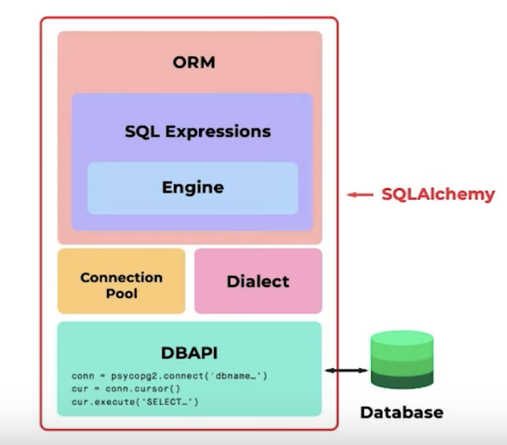

# SQL and Data Modeling for the Web

## Course Introduction

Topics covered:

* How to do *Create*, *Read*, *Update*, and *Delete* (*CRUD*) operations
* How to apply these operations across both *databases* and *web applications*
* How to set up *relationships* between elements of an application
* How to think about important principles and patterns in building *data models* for a web application

### Tech Stack

* Python 3
* `Flask`
* `PostgresSQL`
* `psycopg2`
* `SQLAlchemy`
* `Flask-SQLAlchemy`

## Lesson 2: Interacting with Databases

### Intro

Topics covered:

* Interacting with a remote database (Postgres)
* Database Application Programming Interfaces (DBAPI)
* `psycopg2`

### Relational Databases

A database is a collection of data. A database system is a system for storing, retrieving, and writing data to ta
database. Benefits of databases include:

* Persistence
* Shared source of truth
* Ability to store many types of data
* Concurrency control There are many other types of databases not covered in this course:
* Document stores, like MongoDB
* Object databases, like Perst
* Column stores, like Cassandra
* Graph databases like Neo4j

#### Additional Resources

* [Intro to Relational Databases](https://www.udacity.com/course/intro-to-relational-databases--ud197)  Udacity course
* [An Introduction to Relational Databases](https://www.youtube.com/watch?v=z2kbsG8zsLM)  YouTube video

### Primary Keys & Foreign Keys

#### Primary Key

Every row should have a column or set of columns that is a unique identifier for a particular row. PKs with multiple
columns are known as **composite keys**.

#### Foreign Key

A primary key in another table, these are used to map relationships between tables.

### SQL

Structured Query Language (SQL) is a standard language for interacting with a database. There are many different
dialects of SQL. This course will cover:

* `INSERT`
* `UPDATE`
* `DELETE`
* `SELECT`
* `CREATE TABLE`
* `ALTER TABLE`
* `DROP TABLE`
* `ADD COLUMN`
* `DROP COLUMN`
* `INNER/OUTER JOIN` (`LEFT` and `RIGHT`)
* `GROUP BY`, `SUM`, and `COUNT`

### Execution Plan

The DBMS takes SQL and generates a query plan. The plan can be reviewed and the query tweaked to improve performance.
See also:

* [Explaining the unexplainable – part 2 – select * from depesz;](https://www.depesz.com/2013/04/27/explaining-the-unexplainable-part-2/#seq-scan)
* [25 tips to Improve SQL Query Performance - WinWire](https://www.winwire.com/25-tips-to-improve-sql-query-performance/)
* [PostgreSQL CREATE INDEX By Practical Examples](http://www.postgresqltutorial.com/postgresql-indexes/postgresql-create-index/)
* [Use the Force, Luke](https://i.imgflip.com/3oakl8.jpg)
* [What is a HashTable Data Structure](https://www.youtube.com/watch?v=MfhjkfocRR0)  video explanation by Paul
  Programming
* [Intro to Hash tables](https://www.slideshare.net/AmyHua/intro-to-hash-tables)

### Client-Server Model

A server is a centralized program that communicates over a network to provide some service to *clients*. A client is a
program (a web browser, for instance) that can request data from the server.

#### Adding databases

A database client is any program that can send a request to a database. The web server can simultaneously be a client of
the database.

```
Client ---> Server ---> Database
```

### TCP/IP

Transmission Control Protocol/Internet Protocol (TCP/IP) is a set of communication rules that hosts use to communicate
with one another on the Internet. Postgres fulfills the standard client/server model and was designed to be used over
the web.

An IP address identifies the location of a computer on a network. Each IP address has many ports, which are used to
route different types of traffic. HTTP traffic typically uses port 80 and Postgres typically uses 5432.

#### Additional Resources

* In addition to *port 80* and *port 5432*, there are a number of other common ports you might want to get familiar
  with. Here’s a list of  [14 of the most common ports](https://opensource.com/article/18/10/common-network-ports) .
* If you’re interested in going into much greater depth on computer networking, you can check out the
  free  [Udacity Course on Computer Networking offered by Georgia Tech](https://www.udacity.com/course/computer-networking--ud436)
  .

### Connections and Sessions in TCP/IP

Since TCP/IP is a connection-based protocol, a client and server will need to establish a **connection** to communicate
with one another. Connecting starts a **session**. In a database session, many **transaction** can occur. A **
transaction** does work to commit changes to a database.

### Transactions

Transactions capture logical bundles of work. Work is structured into transactions so that it can either succeed or
fail. In case of success, the work is done, and in case of failure, the transaction is rolled back. To ensure
consistency and integrity, databases use these atomic transactions to handle commits and rollbacks correctly. These are
known as **[ACID transactions](https://www.geeksforgeeks.org/acid-properties-in-dbms/)**:

* Atomic
* Consistency
* Isolation
* Durability

### DBAPIs and `psycopg2`

A Database Application Programming Interfaces (DBAPIs) provides a standard interface for a programming language to talk
to a relational database. These are sometimes known as database adapters. Different APIs exist for every server,
framework, or language/database system. Examples of these include:

* For Ruby (e.g. for Sinatra, Ruby on Rails):  [pg](https://www.ruby-toolbox.com/projects/pg)
* For NodeJS:  [node-postgres](https://node-postgres.com/)
* For Python (e.g. for Flask, Django):  [pyscopg2](http://initd.org/psycopg/)

## Lesson 3: SQLAlchemy Basics

### Intro

SQLAlchemy is the most popular open source Python library for relational databases. It’s an Object-Relational Mapping (
ORM) library, which provides an OOP interface for database interactions.

#### OOP Syntax

A `CREATE TABLE` statement like the following:

```
CREATE TABLE todos (
	id INTEGER PRIMARY KEY,
	description VARCHAR NOT NULL,
	completed BOOLEAN NOT NULL DEFAULT FALSE
);
```

can be written in SQLAlchemy like this:

```
# Our todo table inherits from SQLAlchemy's db model
class Todo(db.Model):
	id = db.Column(db.Integer, primary_key=True)
	description = db.Column(db.String(), nullable=False)
	completed = db.Column(db.Boolean, nullable=False, default=False)
```

A query like this:

```
SELECT * FROM todos
```

becomes this, which has the additional benefit of being dialect-agnostic:

```
Todo.query.all()
```

#### Additional Benefits

* Features **function-based query construction**: allows SQL clauses to be built via Python functions and expressions.
* **Avoid writing raw SQL**. It generates SQL and Python code for you to access tables, which leads to less
  database-related overhead in terms of the volume of code you need to write overall to interact with your models.
* Moreover, you can **avoid sending SQL to the database on every call**. The SQLAlchemy ORM library features **automatic
  caching**, caching collections and references between objects once initially loaded.

#### ORMs in other languages

* [Sequelize](https://sequelize.org/)  and  [Bookshelf.js](https://bookshelfjs.org/)  for NodeJS
* [ActiveRecord](https://guides.rubyonrails.org/active_record_basics.html) , which is used
  inside  [Ruby on Rails](https://rubyonrails.org/)
* [CakePHP](https://book.cakephp.org/3/en/orm.html)  for PHP.

### Layers of Abstraction

DBAPIs are simple but not scalable or conducive to complexity. SQLAlchemy offers several layers of abstraction and
tooling for more convenient DB interactions:



The lowest level offers a DBAPI, but SQLAlchemy is simply a SQL generator. SQLAlchemy depends on `psycopg2` or other
DBAPIs to send statements to the database. At the other end is the ORM, which allows Pythonic dialect-agnostic
interactions.

### The Dialect

The Dialect layer abstracts dialects away from the developer. It allows us to switch out seamlessly between them.
[SQLAlchemy Docs on the Dialect](https://docs.sqlalchemy.org/en/latest/dialects/)

### The Connection Pool

This abstracts the need to open, close, and manage connections to DBs. Connections are easily reused after they are
started. This reduces dropped connections and helps avoid making many small changes.
[SQLAlchemy Docs on its Connection Pooling](https://docs.sqlalchemy.org/en/latest/core/pooling.html)

### The Engine

The Engine is one of three main layers for how we interact with the database. It is the lowest layer of database
interaction and is similar to using `psycopg2` to manage a connection directly.

```
from sqlalchemy import create_engine

engine = create_engin("postgres://...")
conn = engine.connect()
result = conn.execute("SELECT * FROM vehicles;")

row = result.fetchone()
rows = result.fetchall()

result.close()
```

* The Engine in SQLAlchemy refers to both itself, the Dialect and the Connection Pool, which all work together to
  interface with our database.
* A connection pool gets automatically created when we create a SQLAlchemy engine.
  [SQLAlchemy Docs on the Engine](https://docs.sqlalchemy.org/en/latest/core/engines.html) .

### SQL Expressions

Instead of sending raw SQL using the Engine, we can build Python objects:

```
# Instantiate a table
todos = Table("todos", ...)

# Insert values
ins = todos.insert().values(
	description="Clean my room",
	completed=False
)

# Select rows
s = select([todos])

conn = engine.connect()
result = conn.execute(ins)
result = conn.execute(s)

result.close()

todos.c.description
	-> <Column 'description' in 'todos' table>
```

### SQLAlchemy ORM

The ORM is the highest level of abstraction. The ORM lets us compose SQL expressions by building Python objects which
map to tables in the database.

SQLAlchemy is split into two libraries:

* SQLAlchemy Core
* SQLAlchemy ORM: offered as an optional library
    * ORM uses the Core library inside
    * Lets us map from the database schema to the application’s objects
      

### Mapping Between Tables and Classes

In Python we instantiate a class like this:

```
class Human:
	def __init__(self, first_name, last_name, age):
		self.first_name = first_name
		self.last_name = last_name
		self.age = age
```

and create objects as instances of that class like this:

```
sarah = Human("Sarah", "Silverman", 48)
bob = Human("Bob", "Saget", 54)
```

In SQL we may create a similar table like this:

```
CREATE TABLE human (
	id INTEGER PRIMARY KEY,
	first_name VARCHAR,
	last_name VARCHAR,
	age INTEGER
);
```

Note the similarities:

* A column matches to a class attribute
* The table schema maps to the class definition
* Table rows map to instances of the class

### Hello App with Flask-SQLAlchemy - Part 1

* [Flask Docs](https://flask.palletsprojects.com/)  under “Quickstart”
* [Flask-SQLAlchemy Docs](http://flask-sqlalchemy.palletsprojects.com/)  under “Quickstart”

Application [here](./app.py)

### Connecting to the Database

### db.Model and Defining Models

### Syncing Models, db.create_all()

### Inserting Records, Using Debug Mode

### Experimenting in Interactive Mode

### SQLAlchemy Data Types

### SQLAlchemy Constraints

# fsnd/sql-data-modeling

